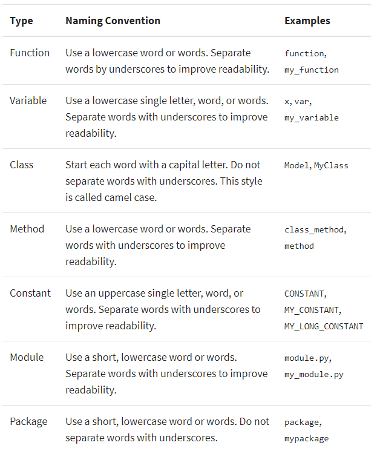

# CTI with NLP
**CTI (Cyber Threat Intelligence) with NLP**

- Starting with text collection, the goal is to build a server to automate various functions.
- Extract Cybersecurity Threat Information by automatically processing security-related text documents.

[](https://opensource.org/licenses/Apache-2.0)

<br/>

## Table of Contents

- Modules
  - dataset
  - OPEN-DATASET
  - STANFORD-OPENIE-PYTHON
  - NER-WITH-SPACY
  - TEXTHERO
  - BERT-NER
  - FLASK-SERVER
- Python Naming Convention
- Text Data Preprocessing
  - Modin : Get faster pandas with Modin
  - doccano : https://github.com/doccano/doccano
- Natural Language Processing
  - spaCy
- Text Data Archiving and Management
  - MongoDB
- Reference
  - STIX / TAXI
  - MITRE ATT&CK

<br/>

<br/>

## # Python Naming Style

<p align="center">
    
</p>

<br/>

<br/>

## # Get faster pandas with Modin

<p align="center">
    
</p>

<br/>

<br/>

## # MongoDB

```
> mongod -dbpath
```

<p align="center">
    
</p>

<br/>

<br/>

## Reference

### # STIX / TAXI

> https://www.anomali.com/resources/what-are-stix-taxii

STIX and TAXII are standards developed in an effort to improve the prevention and mitigation of cyber-attacks.

STIX states the what of threat intelligence, while TAXII defines how that information is relayed. Unlike previous methods of sharing, STIX and TAXII are machine-readable and therefore easily automated.

<p align="center">
    
</p>

<br/>

<br/>

### # MITRE ATT&CK®

> https://attack.mitre.org/

MITRE ATT&CK® is a globally-accessible knowledge base of adversary tactics and techniques based on real-world observations.

The ATT&CK knowledge base is used as a foundation for the development of specific threat models and methodologies in the private sector, in government, and in the cybersecurity product and service community.
